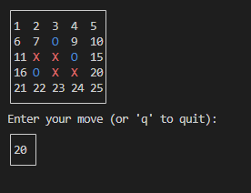

# TicTacToe

This is a simple implementation of a multiplayer TicTacToe-like game in Python.
It supports arbitrary board sizes and N-in-a-row to win.

On Linux or macOS, this should run with Python 3.10.5 or later.

If you're on Windows, you need to install the `windows-curses` package:

```
pip install windows-curses
```

Tested with Python 3.10.5 and `windows-curses` 2.3.0.

<p align="center">
  
</p>

To run, just do:

```
python3 main.py
```